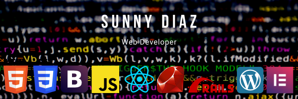
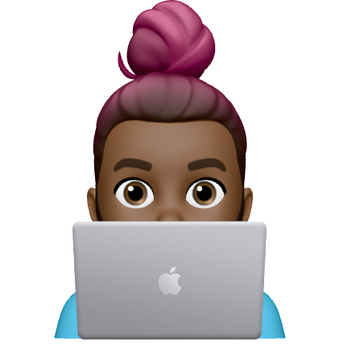
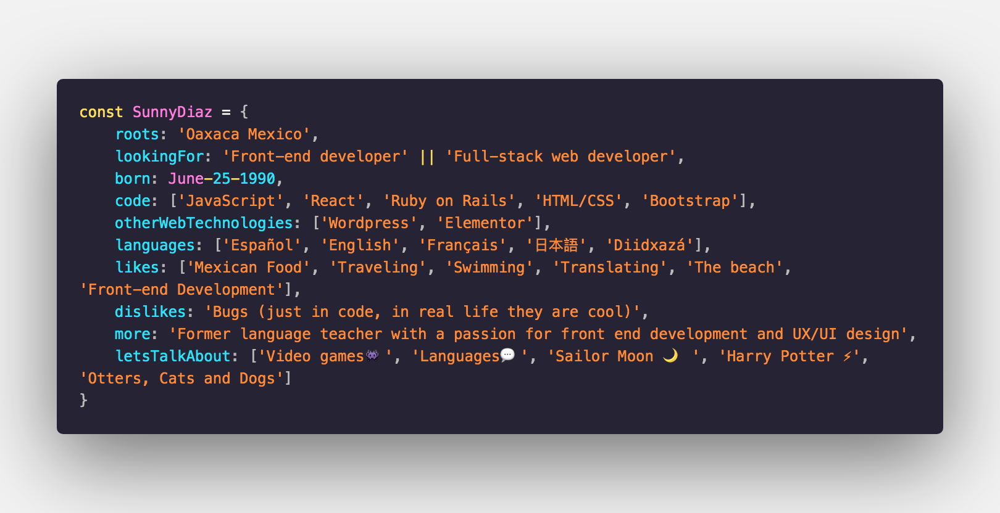
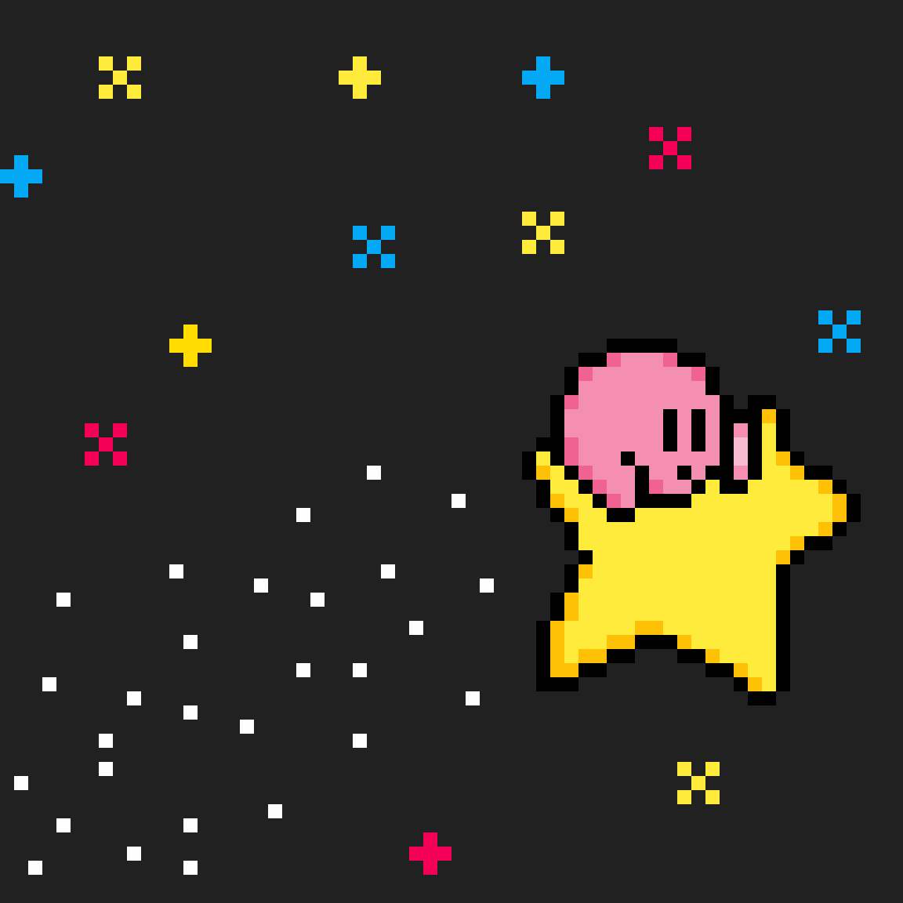

## 


## About Me
 [](https://www.linkedin.com/in/jose-f-silva/)




```text
    🔥 Editors:
VS Code
████████████████████████

💻 Operating System:
Mac OS
█████████████████████████
```


[](https://github.com/sunnysparks/github-readme-stats)  [](https://github.com/anuraghazra/github-readme-stats)


## <p>Click on kirby's star to warp to my portfolio <a href="https://sunnydiaz.com/"></a>
</p>

<!--
**SunnySparks/SunnySparks** is a ✨ _special_ ✨ repository because its `README.md` (this file) appears on your GitHub profile.

Here are some ideas to get you started:

- 🔭 I’m currently working on ...
- 🌱 I’m currently learning ...
- 👯 I’m looking to collaborate on ...
- 🤔 I’m looking for help with ...
- 💬 Ask me about ...
- 📫 How to reach me: ...
- 😄 Pronouns: ...
- ⚡ Fun fact: ...
-->
